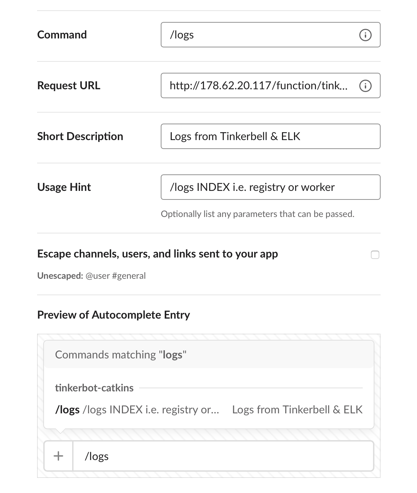
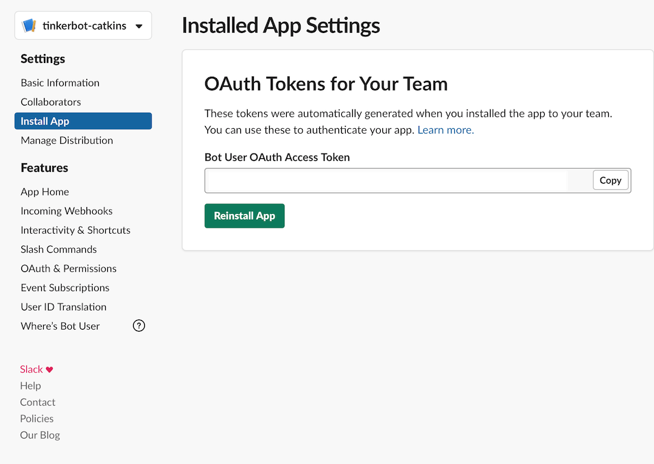
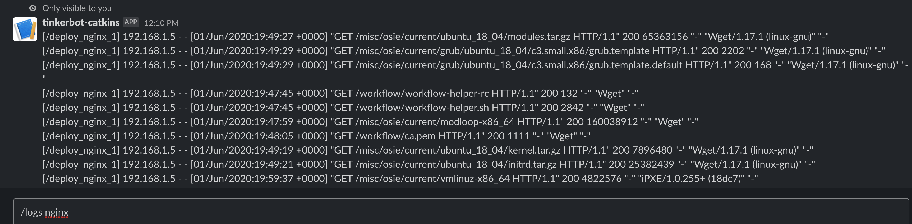
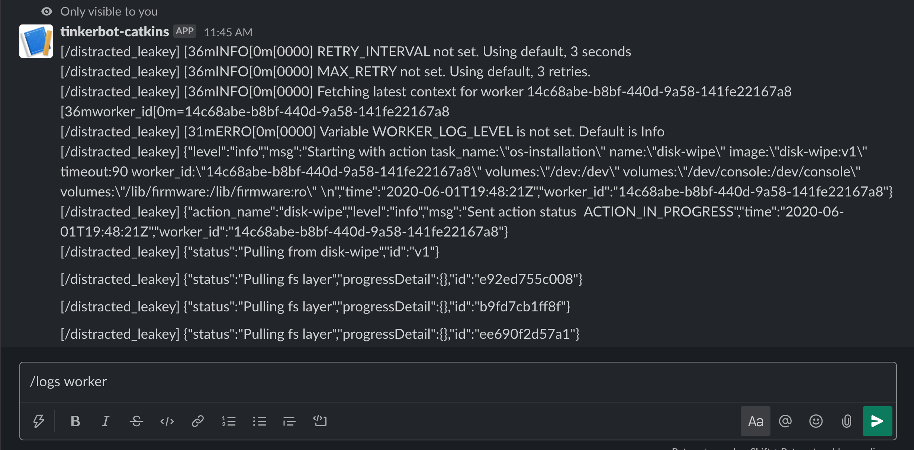
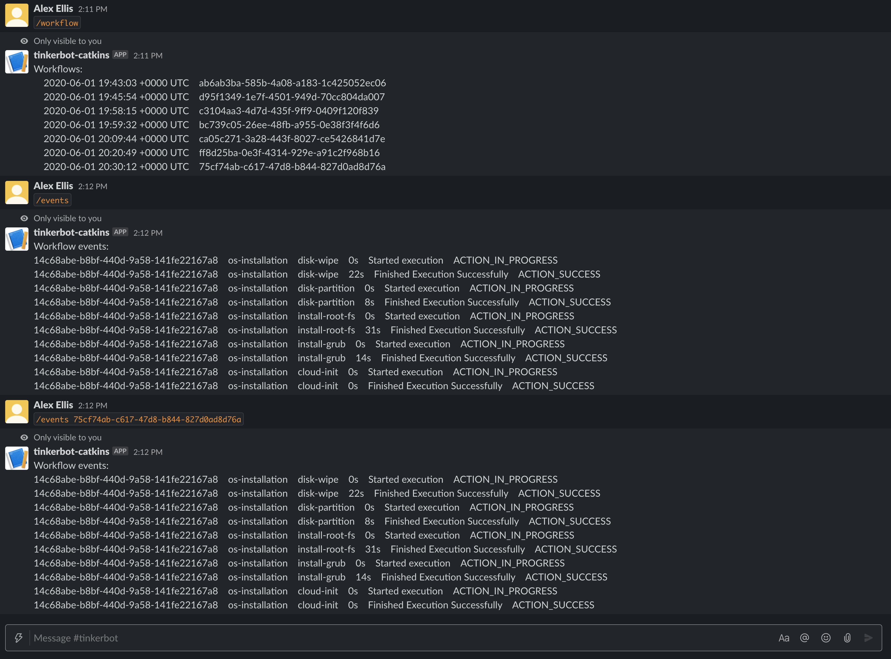
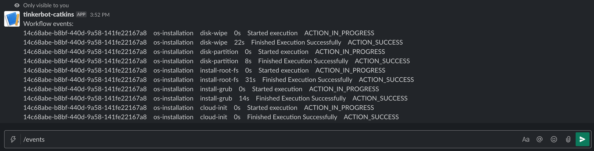

# tinkerbot

ChatOps for Tinkerbell

tinkerbot is a Slackbot which brings ChatOps to Packet's Tinkerbell project for bare-metal automation.

## How does it work?

tinkerbot makes use of both the gRPC API of Tinkerbell, and the HTTP REST API of ELK where Tinkerbell stores all its logs.

The bot is written in Go using the [OpenFaaS](https://www.openfaas.com/) `golang-middleware` template and is packaged as a Docker container. 

In this README you'll find instructions for configuring and deploying tinkerbot to your Tinkerbell provisioner using OpenFaaS on k3s, however you may also be able to run tinkerbot with the lighter-weight [faasd](https://github.com/openfaas/faasd) project which does not require Kubernetes.

## Commands:

### Logs

Fetch logs from ELK for a specific Tinkerbell component

```
/logs INDEX
```

Examples include:

```
/logs worker
/logs tink-server
/logs boots
/logs nginx
/logs registry
```

### Workflows

Get a list of workflows

```
/workflow
```

### Events

Get the events for the latest updated workflow.

```
/events
```

> This command is ideal for debugging or for monitoring an in-flight workflow.

Get the events for a given workflow

```
/events <WORKFLOW_ID>
```

## Installation

### Pre-reqs

* You will need your own Slack workspace, or administrative access to create and install a Slack app
* OpenFaaS installed with reachability to your ElasticSearch server, i.e. on the provisioner
* A public IP for Slack to send webhooks for the Slash commands, or use [inlets](https://inlets.dev/) for this

### Setup OpenFaaS and Kubernetes on your provisioner

On the provisioner install k3d, which can leverage the existing installation of Docker to run Kubernetes in a container with k3s.

```bash
curl -s https://raw.githubusercontent.com/rancher/k3d/master/install.sh | bash
```

Create a cluster with k3d:

```bash
curl -LO https://storage.googleapis.com/kubernetes-release/release/v1.18.0/bin/linux/amd64/kubectl
chmod +x kubectl
sudo mv kubectl /usr/local/bin/

k3d create cluster --name tinkerbot --server-arg "--no-deploy=traefik" --server-arg "--no-deploy=servicelb"
export KUBECONFIG="$(k3d get-kubeconfig --name tinkerbot)"
```

Now install arkade, to install openfaas:

```bash
curl -sLS https://dl.get-arkade.dev | sudo sh
```

Install OpenFaaS:

```bash
arkade install openfaas
```

Do not follow the instructions printed.

### Expose your OpenFaaS gateway on the provisioner

> If you are running on-premises, or at home, then use the [inlets-operator for Kubernetes instead](https://github.com/inlets/inlets-operator/).

Since we are running k3d within a container, it will not be accessible by Slack for incoming webhooks required for the bot. We will run the [inlets](https://inlets.dev) server process on the provisioner and connect from a pod inside k3s to forward all traffic to the outside world.

```bash
curl -sLS https://inletsctl.inlets.dev | sudo sh

# Download the OSS inlets version
sudo inletsctl download

# Set to your Packet provisioner's public IP
export PUBLIC_IP=192.168.0.61

inletsctl kfwd --if $PUBLIC_IP \
  --from gateway:8080 \
  --namespace openfaas &
```

The command above started an inlets server on your public host, and then started an inlets client as a Pod inside the k3s cluster. This allows the OpenFaaS gateway to be exposed on the host for Slack and for our use.

### Log into OpenFaaS

Now that we have exposed OpenFaaS on the public IP, we can log into it.

```bash
# Set the OpenFaaS URL to the public IP:
export PUBLIC_IP=192.168.0.61

export OPENFAAS_URL=http://$PUBLIC_IP:8080
```

Run `arkade info openfaas` and follow the instructions:

```bash
curl -SLsf https://cli.openfaas.com | sudo sh

# Forward the gateway to your machine
kubectl rollout status -n openfaas deploy/gateway

# If basic auth is enabled, you can now log into your gateway:
PASSWORD=$(kubectl get secret -n openfaas basic-auth -o jsonpath="{.data.basic-auth-password}" | base64 --decode; echo)

echo -n $PASSWORD | faas-cli login --username admin --password-stdin
```

Check that the login worked, you should see no functions listed for the following:

```bash
faas-cli list
Function                      	Invocations    	Replicas
```

### Create a Slack app

Slack uses "apps" to integrate with its API. Create an app and install it to your Slack workspace.

Click Workspace Settings -> API

Create a new Slack command for each command you want to enable:



For request URL enter the following, changing $IP to the IP address of your provisioner and port 8080:

```
http://$IP:8080/function/tinkerbot
```

So add - `/logs` and `/last-workflow` to start with.

You will need to enter the public IP of your OpenFaaS gateway, or your inlets tunnel if you are using a tool like k3d or KinD.

Once you have created the command, you can install it to a workspace:



### Configure the bot

You will create the following secrets:

* `validation-token` - Slack token for verification - navigate to Basic Information -> App Credentials and copy the text from `Verification Token`

Run the following:

```bash
export VALIDATION_TOKEN="w7ub1M8Jk2mYHEtpmtgXiLzr"

faas-cli secret create validation-token --from-literal $VALIDATION_TOKEN
```

Now edit stack.yml and update the environment variable for where your ELK cluster is located. This is probably the public IP of your provisioner.

```yaml
    environment:
      elk_host: http://192.168.1.1:9200/
```

Here, I am using an IP on my local network. By default Tinkerbell exposes ElasticSearch on all interfaces on your provisioner. Check the interfaces with `ip addr` or `ifconfig`.

If you are using the `workflow` command, you'll also need to add the following entries (changing the IP as per the step above):

```yaml
    environment:
      TINKERBELL_GRPC_AUTHORITY: 192.168.1.1:42113
      TINKERBELL_CERT_URL: http://192.168.1.1:42114/cert
```

> Note: TINKERBELL_GRPC_AUTHORITY does not include a URL scheme

### Deploy the bot

```bash
faas-cli deploy -f stack.yml
```

You can view the bot's logs with `faas-cli logs tinkerbot`.

### Try out the bot

Logs from Nginx:



Logs from the worker:



Showing the list of workflows:



Showing the events for the latest updated workflow:



## Taking it further

* Enable HTTPS for OpenFaaS

  You can enable HTTPS for OpenFaaS [using this guide for inlets PRO](https://docs.inlets.dev/#/get-started/quickstart-ingresscontroller-cert-manager?id=expose-your-ingresscontroller-and-get-tls-from-letsencrypt) or if you installed Kubernetes directly on the provisioner, [you can try this guide](https://blog.alexellis.io/tls-the-easy-way-with-openfaas-and-k3sup/).

* Do you want to hack on the functions?

  If you wish to hack on the bot and deploy a new version, replace `alexellis2` in the `image:` field with your own Docker Hub account, and then run `faas-cli up` instead of `faas-cli deploy`.

  If you want to work on the code, you can run `faas-cli build/up`, or for quicker iterations just run `go test ./tinkerbot/cmd/` or `go build` within the `./tinkerbot/cmd/` folder.

* What if I don't want to run Kubernetes?

  You can try [faasd](https://github.com/openfaas/faasd) which only requires containerd, which should already be installed on your provisioner.

* Why do I need to run OpenFaaS on the provisioner?

  You need to run OpenFaaS on the provisioner, or on another host within the same private network so that it can access the gRPC API and ELK.

## Getting help and contributing

Feel free to join the [Packet community Slack](https://slack.packet.com) and start a discussion in the `#tinkerbell` channel.

If you'd like specific help about OpenFaaS, join [the OpenFaaS community on Slack](https://slack.openfaas.io/)

License: MIT

This project follows the [Developer Certificate of Origin](https://developercertificate.org), all PRs must include a Signed-off-by: line using `git commit -s`.